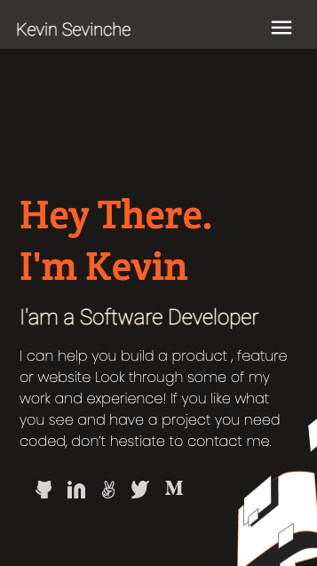
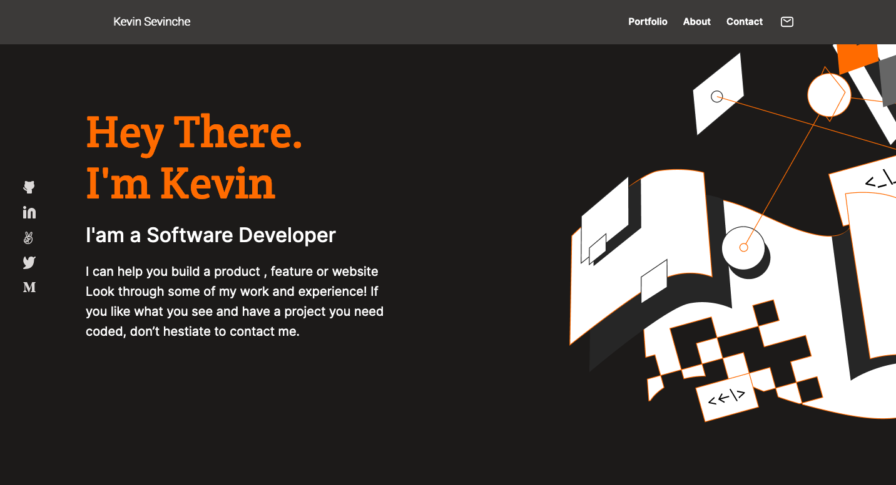

# My-Portfolio

> This is my portfolio.

  

## Built With

- HTML & CSS

## Demo

- Online (https://sevinchek.github.io/My-Portfolio/)

## Project Setup

Clone this repository (use this SSH key git@github.com:sevinchek/My-Portfolio.git) and then open the index.html file with your favorite browser.

To visualize the project you need to change your browser's viewport:

For mobile version set the viewport's width to 375px.
For desktop version set the viewport's width to 1024px or more.

To change your browser's viewport remember to use:

- Responsive Design Mode (Firefox)
- Device Mode (Google Chrome)

## Authors

👤 **Kevin**

- GitHub: [@sevinchek](https://github.com/sevinchek)
- Twitter: [@sevinchek](https://twitter.com/sevinchek)
- LinkedIn: [LinkedIn](https://linkedin.com/in/sevinchek)

## 🤝 Contributing

Contributions, issues, and feature requests are welcome!

## Show your support

Give a ⭐️ if you like this project
